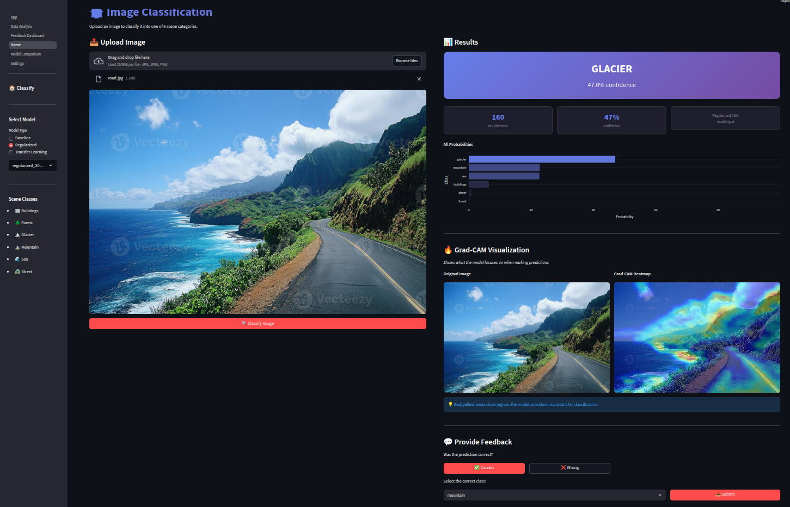
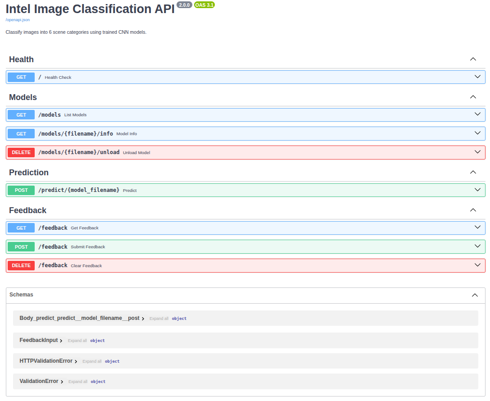

# Image Classification Project

CNN-based image classification with FastAPI backend and Streamlit dashboard.

## Screenshots




## Dataset

**Intel Image Classification** from Kaggle (~25,000 images, 6 classes).

Download: [kaggle.com/datasets/puneet6060/intel-image-classification](https://www.kaggle.com/datasets/puneet6060/intel-image-classification)

Required structure:
```
data/
├── train/
│   ├── buildings/
│   ├── forest/
│   ├── glacier/
│   ├── mountain/
│   ├── sea/
│   └── street/
└── test/
    └── (same classes)
```

## Quick Start (Docker)

```bash
# 1. Start services (with permission fix for feedback.csv)
HOST_UID=$(id -u) HOST_GID=$(id -g) docker compose up --build

# 2. Access
# Streamlit: http://localhost:8501
# API docs:  http://localhost:8000/docs

# 3. Stop
docker compose down
```

### Custom Dataset Path

```bash
HOST_UID=$(id -u) HOST_GID=$(id -g) DATASET_PATH=/path/to/dataset docker compose up --build
```

In Streamlit Settings, use: `/app/data/train` and `/app/data/test`

### Using .env File (optional)

Create `.env` in project root:
```env
HOST_UID=1001
HOST_GID=1001
DATASET_PATH=/home/user/datasets/intel_images
```

Then just run: `docker compose up --build`

## Run Locally (No Docker)

```bash
# Install dependencies
pip install -r requirements.txt

# Terminal 1: API
uvicorn api.main:app --port 8000

# Terminal 2: Streamlit
API_URL=http://localhost:8000 streamlit run streamlit/app.py
```

In local mode, use any absolute path in Settings (e.g., `/home/user/datasets/train`).

## Models

| Model | Accuracy |
|-------|----------|
| Baseline | 73% |
| Regularized | 79% |
| Transfer Learning (MobileNetV2) | 88% |

## API Endpoints

- `GET /models` - List models
- `POST /predict/{model}` - Classify image
- `POST /feedback` - Submit feedback
- `GET /feedback` - Get all feedback

## Streamlit Pages

- **Home** - Upload & predict with Grad-CAM visualization
- **Model Comparison** - Compare all models
- **Data Analysis** - Dataset statistics
- **Feedback Dashboard** - User feedback tracking

## Documentation

- [RUN.md](RUN.md) - Detailed run instructions & training
- [DATASET_SETUP.md](DATASET_SETUP.md) - Dataset configuration
- [TROUBLESHOOTING.md](TROUBLESHOOTING.md) - Common issues
- [requirements.txt](requirements.txt) - Python dependencies

## Technologies

TensorFlow, FastAPI, Streamlit, Docker
